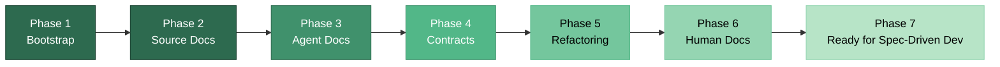
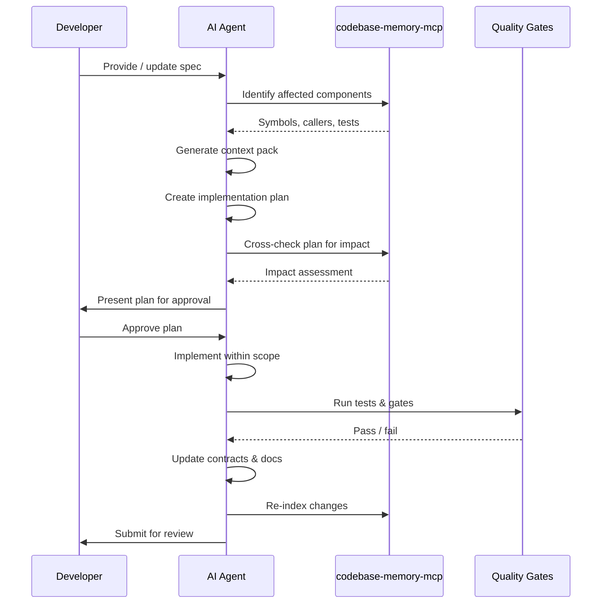
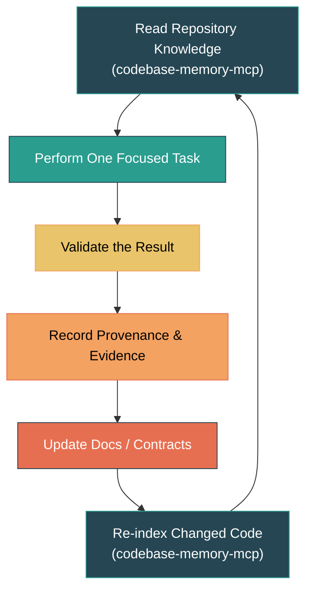

# Phased Approach

[[_TOC_]]

## Phase Progression

Readiness is built through seven sequential phases. Each phase produces artifacts that subsequent phases depend on.



> [!NOTE]
> Phases are presented linearly. Phase parallelism may be explored in future iterations.

---

## Phase 1: Agentic Bootstrap ✅

> **Objective**: Make the repository executable, discoverable, and safe for agent interaction.
>
> **Tools**: `codebase-memory-mcp` ✅

### Activities

- Configure and run `codebase-memory-mcp` to index source files, symbols, relationships, dependencies, and tests.
- Create root and component-level `AGENTS.md` files. A good example is [`here`.](https://github.com/Nistapp/agentic-tdd/blob/main/AGENTS.md)
- Standardize commands using a `Makefile`, `Taskfile`, or package scripts:

```bash
task format
task lint
task typecheck
task test
task check
task security
```

- Add formatters, linters, type checkers, and basic security scanning (aligned with [OWASP](https://owasp.org/) guidelines where applicable).
- Establish quality baselines for existing technical debt.
- Enforce a **"no new violations"** policy.
- Ensure local and CI checks use the **same commands**.
- Establish initial Constraint Engineering allow/deny lists.

> [!NOTE]
> CI/CD integration patterns (PR workflows, branch protection, pipeline gates) will be detailed in the upcoming `agentic-docstrings` architecture documentation. A good example is detailed [`here`.](https://github.com/Nistapp/agentic-tdd/blob/main/AGENTS.md#11-git-commit-conventions--release-lifecycle-strict)

### Key Deliverables

| Deliverable | Format | Consumer |
|-------------|--------|----------|
| `codebase-memory-mcp` index | Graph database | Agents, all tools |
| `AGENTS.md` files | Markdown | Agents |
| `Taskfile` / `Makefile` | Script | Agents, CI, humans |
| Quality baselines | Config files | CI |
| Allow/deny lists | Config files | Agents |

**Result:** An agent can inspect a bounded area, modify code, and run a known verification command.

> [!IMPORTANT]
> Phase-1 itself is a significant improvement for any repository. Agent performance should increase dramatically from baseline immediately after Phase-1. Anecdotally, we have observed significant improvement in accuracy and token efficiency after just this one phase.

---

## Phase 2: Source-Level Documentation 📋

> **Objective**: Generate and maintain documentation close to the source code.
>
> **Tools**: `agentic-docstrings` 📋 Planned

### Generated Artifacts

- Module, class, function, and method summaries.
- Parameter and return-value descriptions.
- Exceptions and error behavior.
- Side effects.
- Important preconditions, postconditions, and invariants.
- Links to relevant tests and contracts.

### Generation Rules

The tool must be **conservative**:

- Evaluate existing human-written documentation for accuracy.
- Update only missing or stale documentation.
- Avoid unsupported business or security claims.
- Record generation metadata and evidence (provenance).
- Produce no unrelated code changes.
- Be idempotent — repeated execution produces no unnecessary diff.

### Key Deliverables

| Deliverable | Format | Consumer |
|-------------|--------|----------|
| Docstrings and inline docs | Source code | Agents, humans |
| Provenance metadata | JSON / comments | Audit, CI |
| Updated `codebase-memory-mcp` index | Graph database | Agents, all tools |

**Result:** Agents can understand important symbols without reading the entire repository.

---

## Phase 3: Agent-Oriented Documentation 📋

> **Objective**: Create structured documentation specifically for coding agents, including per-component constraint definitions.
>
> **Tools**: `agentic-agentDocs` 📋 Planned (conceptualisation)

### Generated Artifacts

- Component responsibilities.
- Public interfaces.
- Dependencies and **forbidden dependencies**.
- Data classification.
- Side effects.
- Important invariants.
- Relevant tests and contracts.
- Verification commands.
- Ownership and review requirements.
- Rollback procedures.
- Architecture rules.
- **Task-specific context packs.**
- **Per-component Constraint Engineering definitions** — explicit allow/deny rules for files, methods, interfaces, directories, and commands.

> [!NOTE]
> This is where [Constraint Engineering](Overview.md#constraint-engineering) becomes enforceable at the component level. The `agentic-agentDocs` tool generates the constraint definitions that agents must respect.

The context pack contains only the information relevant to a task: related symbols, callers, callees, tests, contracts, and architecture decisions.

### Key Deliverables

| Deliverable | Format | Consumer |
|-------------|--------|----------|
| Agent-oriented docs | Structured Markdown / JSON | Agents |
| Task-specific context packs | Bundled context | Agents |
| Per-component constraint definitions | Config / Markdown | Agents, CI |
| Updated `codebase-memory-mcp` index | Graph database | Agents, all tools |

**Result:** Agents receive focused, task-specific context instead of the entire codebase.

---

## Phase 4: Contracts and Behavior Baselines 💡

> **Objective**: Make interfaces and existing behavior explicit through contracts and characterization tests.
>
> **Tools**: `agentic-contracts` 💡 Aspirational · `agentic-characterize` 💡 Aspirational

### Coverage

- [OpenAPI](https://spec.openapis.org/oas/latest.html) and REST contracts.
- Event and message schemas.
- Database schemas.
- Configuration schemas.
- Error contracts.
- Consumer-provider relationships.
- Characterization tests.
- Golden-master / approval tests.
- Replay tests for selected critical workflows.

> [!WARNING]
> Characterization tests record what the system **currently does**. They should not automatically be treated as proof that the behavior is desirable.

Runtime instrumentation is added selectively around high-risk or high-value workflows. Complete instrumentation is not required before work begins.

### Key Deliverables

| Deliverable | Format | Consumer |
|-------------|--------|----------|
| API contracts | OpenAPI / JSON Schema | Agents, CI, consumers |
| Event and message schemas | JSON Schema / Avro | Agents, CI |
| Characterization tests | Test files | CI, agents |
| Golden-master baselines | Snapshot files | CI |
| Updated `codebase-memory-mcp` index | Graph database | Agents, all tools |

**Result:** Agents can change code while detecting unintended behavioral changes.

---

## Phase 5 (Optional):  Refactoring 

> **Objective**: Support controlled feature development and refactoring within legacy code.
>
> **Tools**: Manual. This is also optional.

### Refactoring Principles

- Work within **one bounded component** at a time.
- Make **small, reviewable changes**.
- Separate mechanical changes from behavior changes.
- Run characterization, unit, contract, and architecture checks.
- **Prevent agents from weakening tests** to make changes pass.
- Use independent verification for tests and security.
- Update documentation and contracts when behavior or structure changes.

Observability can be added incrementally to areas being changed: structured logs, correlation IDs, key metrics, traces around external calls, and clear error categories.

### Key Deliverables

| Deliverable | Format | Consumer |
|-------------|--------|----------|
| Refactored code | Source code | Humans, CI |
| Updated tests | Test files | CI |
| Updated documentation and contracts | Various | Agents, humans |
| Observability additions | Source code / config | Operations |
| Updated `codebase-memory-mcp` index | Graph database | Agents, all tools |

**Result:** Legacy code becomes easier to change without losing protected behavior.

---

## Phase 6: Human Repository Documentation 💡

> **Objective**: Create documentation for developers, operators, and other human stakeholders.
>
> **Tools**: `agentic-repoDocs` 💡 Aspirational

The documentation follows the [Diátaxis](https://diataxis.fr/) model:

- **Tutorials** — learning-oriented walkthroughs.
- **How-to guides** — task-oriented instructions.
- **Reference documentation** — information-oriented descriptions.
- **Architectural explanations** — understanding-oriented discussion.

### Inputs

- Source-level documentation (Phase 2).
- Agent-oriented documentation (Phase 3).
- Contracts and schemas (Phase 4).
- Tests.
- ADRs.
- Build and deployment commands.
- Runbooks.
- Ownership information.

Generated documentation should link back to the source code, tests, contracts, and architecture decisions from which it was derived.

### Key Deliverables

| Deliverable | Format | Consumer |
|-------------|--------|----------|
| Tutorials, how-tos, reference, explanations | Markdown | Humans |
| Cross-references to source, tests, contracts | Links | Humans, agents |
| Updated `codebase-memory-mcp` index | Graph database | Agents, all tools |

**Result:** Developers can learn, operate, and maintain the repository without relying on tribal knowledge.

> [!NOTE]
> We created these manually for `agentic-tdd` and can be found [`here`](https://github.com/Nistapp/agentic-tdd/tree/main/docs). `agentic-repoDocs` will automate this process in the future.

---

## Phase 7: Spec-Driven Feature Development

> **Objective**: Support regular feature development through a controlled, specification-driven workflow.
>
> **Tools**: `agentic-tdd` ✅ + `codebase-memory-mcp` ✅

Once the preceding foundations are available, agents support feature development through this controlled workflow [See also `agentic-tdd` flow](https://github.com/Nistapp/agentic-tdd#architecture-at-a-glance):



The specification, tests, code, documentation, and runtime behavior evolve together. [`agentic-tdd`](https://github.com/Nistapp/agentic-tdd) will evolve to take advantage of the above phases in the future.

### Key Deliverables

| Deliverable | Format | Consumer |
|-------------|--------|----------|
| Feature specification | Markdown | Humans, agents |
| Implementation plan (impact-checked) | Markdown | Humans |
| Feature code | Source code | CI, humans |
| Updated tests, contracts, docs | Various | CI, agents, humans |

**Result:** Controlled feature development with agent participation, producing code ready for production deployment via SDD/BDD + TDD.

---

## Agentic Cycle for Determinism

Every tool in the ecosystem follows the same general cycle:



This cycle ensures that **every tool operation starts from indexed knowledge and ends by updating it** — preventing drift between the codebase and its documentation.

---

← [Overview](Overview.md) · [Tool Ecosystem →](Tool-Ecosystem.md)
