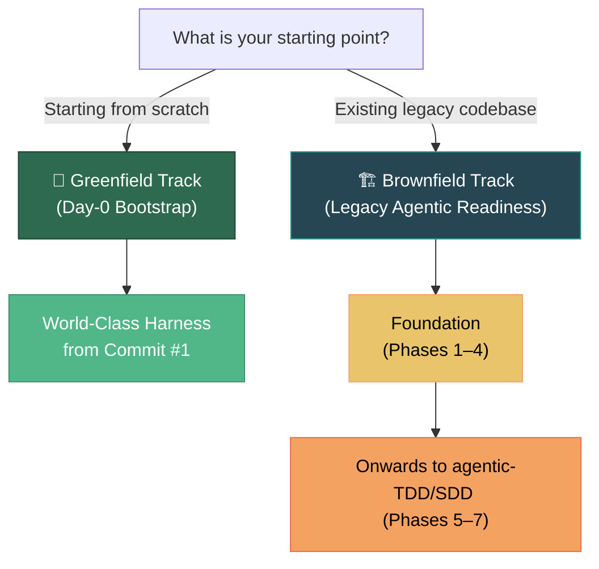

# Codebase Agentic Readiness Framework

> *"The more you sweat in peace, the less you bleed in war."*
> In our context, **sweating in peace** is preparing the codebase for agentic participation. **The war** is when agents are implementing features from user prompts — and an unprepared codebase bleeds rework, hallucinations, and broken builds.

---

## 🎯 Choose Your Track

Whether you are starting a fresh project or modernizing an established monolith, this framework provides the blueprint to make your codebase safe, bounded, and deterministic for AI coding agents.

---

### Track 1: Greenfield / Day-0 Project Setup 🚀

> **For new repositories and services.**

Follow our step-by-step recipe to initialize a TypeScript / Node.js repository with world-class instrumentation before writing a single line of application logic.  While our example is for TS/Node, the principles are the same for any tech/framework. You can point your coding agent to this structure and ask it to regenerate the same structure for your tech/framework. You should have something to review withing minutes.

- 📖 **[Project Initialization Recipe](greenfield-bootstrap/README.md)** — Step-by-step guide across 8 phases.
- 📦 **[Reusable Scaffolding Templates](greenfield-bootstrap/templates/)** — Copy-ready `AGENTS.md`, `biome.json`, GitHub Actions CI/CD workflows, `vitest.config.ts`, DI port interfaces, Diátaxis documentation templates (`docs/STYLE_GUIDE.md`, ADR templates), and the standardized six-verb command surface (`format`, `lint`, `typecheck`, `test`, `check`, `security`).

---

### Track 2: Brownfield / Legacy Codebase Modernization 🏗️

> **For existing codebases, monoliths, and legacy services.**

Follow our phased, incremental methodology to make any existing codebase agentic-ready without requiring a full rewrite.

- 📖 **[Legacy Modernization Overview](brownfield-legacy/README.md)** — The business case, defect reduction, and readiness roadmap.
- 🗺️ **[7-Phase Migration Guide](brownfield-legacy/Phased-Approach.md)**:
  - **Part I: Readiness Foundation (Phases 1–4)** — Bootstrap, Source Docs, Agent Docs, and Behavioral Baselines. *(Mandatory)*
  - **Part II: Post-Readiness Roadmap (Phases 5–7)** — Agent-driven refactoring, human-facing docs, and Spec-Driven Development (SDD/BDD + TDD).

---

## 🏛️ Shared Framework Concepts

Both tracks share the same core intelligence layer and architectural invariants:

| Document | Description |
|---|---|
| **[Overview](shared/Overview.md)** | Core concepts, **Constraint Engineering**, assumptions, and applicability |
| **[Tool Ecosystem](shared/Tool-Ecosystem.md)** | Accelerators (`codebase-memory-mcp`, `agentic-tdd`, etc.), maturity status, and conventions |
| **[Risks and Mitigations](shared/Risks-and-Mitigations.md)** | Risk matrix and safety principles when working with AI coding agents |
| **[Glossary](shared/Glossary.md)** | Canonical definitions of domain terms |
| **[References](shared/References.md)** | External standards, frameworks, and related reading |

---

## 🧠 Core Intelligence Layer

[`codebase-memory-mcp`](https://github.com/DeusData/codebase-memory-mcp) serves as the shared knowledge backbone across all workflows. Both human developers and AI agents query this graph to identify symbols, callers, callees, dependencies, contracts, and relevant documentation before making changes.

---

## 📄 License

This documentation is licensed under the [GNU Free Documentation License, Version 1.3](LICENSE).
