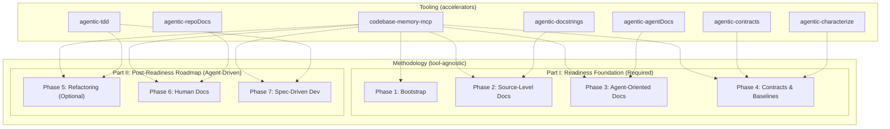
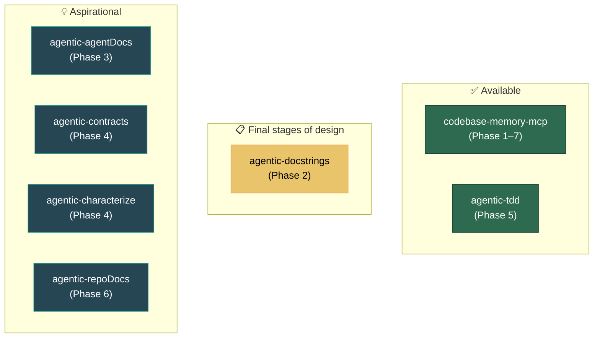

# Tool Ecosystem

[[_TOC_]]

## Methodology vs. Tooling

> [!IMPORTANT]
> The methodology described in this wiki stands on its own. A team can follow the [phased approach](Phased-Approach.md) manually without any of the tools listed below. The tools **accelerate adoption** but are not prerequisites.

The agentic-ready approach has two distinct layers:

A well-prepared codebase should give exceptional results with **any** coding agent — Claude Code, Cursor, OpenCode, Goose — and of course with `agentic-tdd` too.

---

## Tool Maturity

| Tool | Status | Phase | Description |
|------|--------|-------|-------------|
| `codebase-memory-mcp` | ✅ Available | 1–7 | Core intelligence layer. Indexes symbols, relationships, dependencies, tests, contracts. Queried by all phases. |
| `agentic-tdd` | ✅ Available | 5 | Supports controlled, test-driven feature development and refactoring with AI agents. |
| `agentic-docstrings` | 📋 Planned | 2 | Will generate and maintain source-level documentation (docstrings, parameter descriptions, side effects). |
| `agentic-agentDocs` | 📋 Planned | 3 | Will create structured, agent-oriented documentation and task-specific context packs. Currently in conceptualisation. |
| `agentic-contracts` | 💡 Aspirational | 4 | Will generate and validate API contracts, event schemas, and consumer-provider relationships. |
| `agentic-characterize` | 💡 Aspirational | 4 | Will produce characterization tests and golden-master baselines for existing behavior. |
| `agentic-repoDocs` | 💡 Aspirational | 6 | Will create human-facing repository documentation following the Diátaxis model. The manually created docs  `agentic-tdd` can be found [`here`](https://github.com/Nistapp/agentic-tdd/tree/main/docs). `agentic-repoDocs` will automate this process in the future.|

### Maturity Legend

| Badge | Meaning |
|-------|---------|
| ✅ Available | Existing, usable today |
| 📋 Planned | Actively planned for near-term development |
| 💡 Aspirational | Conceptual; development has not started |

### Tool Maturity Map

---

## Shared Conventions

All tools will be published as independent open-source npm packages, each focused on a single responsibility. They will share common conventions for:

- **Configuration** — consistent config file formats and defaults.
- **Reporting** — structured output with provenance metadata.
- **Verification** — each tool validates its own output before committing.
- **Integration** — all tools query and update `codebase-memory-mcp`.

---

← [Home](README.md) · [Phased Approach](Phased-Approach.md) · [Risks and Mitigations](Risks-and-Mitigations.md)
