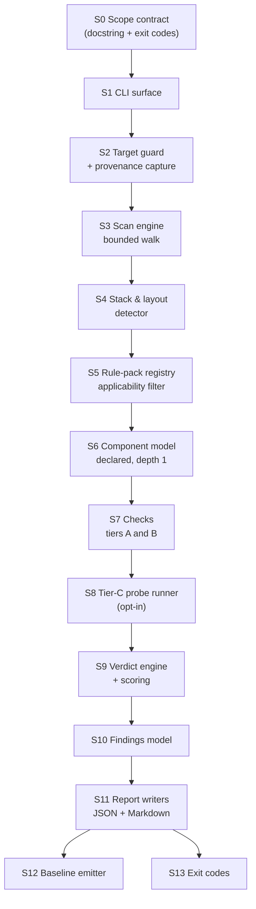

# Scan Engine & Tiering

> **Audience:** Engineers & Maintainers
> **Related ADRs:** [ADR-0001](../adrs/0001-report-not-a-gate.md) · [ADR-0002](../adrs/0002-read-only-and-tier-c-opt-in.md) · [ADR-0003](../adrs/0003-component-depth-declared-depth-1.md) · [ADR-0004](../adrs/0004-no-llm-in-v1.md) · [ADR-0006](../adrs/0006-private-check-helpers-and-ignore-engine.md)
> **Status:** Live for every pipeline stage (S0–S13) and every pack — `IDX`, `AGT`, `EXEC`, `CMD`, `DOC`, `NAV`, `SEC`, `TOOL`, `CI`, `TST`, `BASE`, `CON` (the `CON-04` draft emitter included) and the informational `HYG` set. All 54 scoreable checks are implemented; only the blocked `CON-01` is not evaluated. The Tier-C probe checks (`IDX-03`, `TST-02`) report `UNKNOWN` unless probes are explicitly permitted, and checks that need certainty the scan cannot provide degrade to `UNKNOWN` rather than guessing.

---

## 1. Responsibilities & Boundaries

- **Primary Goal:** Inventory a target repository, decide which checks apply to it, evaluate those checks against
  the framework's Phase 1, and emit a deterministic report.
- **In-Scope:** Traversal, classification, stack detection, rule evaluation, probe execution (opt-in), scoring,
  reporting, provenance.
- **Out-of-Scope (must never happen):** Writing to the target; installing anything; calling an LLM; making a
  network request by default; mutating a git repository; emitting a verdict it did not compute.
- **Language:** Python 3.11+, standard library only, one entry file — the same constraint as
  `python-agentic-bootstrap`, for the same reason: it must run before the target's toolchain exists and must
  work on a machine with nothing installed.

---

## 2. Pipeline Stages



| Stage | Responsibility | Failure behaviour |
|---|---|---|
| **S0** | State the scope contract in the module docstring: read-only, no installs, no network, no LLM, exit codes | — |
| **S1** | Parse arguments, validate combinations (`--run-gates` requires `--allow-probe` list or confirmation) | Exit 1 on bad usage |
| **S2** | Resolve the target, refuse a non-directory, capture git SHA/branch/dirty state, framework revision, rule-set hash, timestamp | Exit 1; never partially scan a bad target |
| **S3** | Bounded walk; produce a file inventory with classification and hashes | Skips unreadable paths and records them as `UNKNOWN` inputs, never a silent pass |
| **S4** | Identify languages, build manifests, test frameworks, CI provider, and package managers | Unknown stack → checks that need it go `UNKNOWN`, the rest still run |
| **S5** | Filter the rule catalogue to applicable checks by ecosystem | A check excluded by applicability is reported as *not applicable*, not as a pass |
| **S6** | Build the component model from build manifests (declared components, depth 1) | No declarations → single root component plus the candidate-component informational list |
| **S7** | Evaluate Tier A and Tier B checks | Individual check failure is a `FAIL`, never a crash |
| **S8** | Execute Tier-C probes if requested, from an allow-list, with per-command timeout | Timeout or non-zero exit is evidence, not an error |
| **S9** | Convert evidence into verdicts; compute the Phase-1 score; build the unattested list | Weights sum to 1.0; no check may be scored twice |
| **S10** | Emit findings with stable ids, evidence, severity, and remediation hint | — |
| **S11** | Write JSON (machine) and Markdown (human) to the `--out` path | Refuses to overwrite an existing report without `--force` |
| **S12** | Optionally emit the inputs a remediation pass needs | — |
| **S13** | Exit 0 / 1 / 2 per the readiness model | — |

---

## 3. Bounded Traversal

Unbounded traversal is how a scanning tool becomes unusable on the repositories that need it most. The walk is
bounded by construction:

| Rule | Behaviour |
|---|---|
| Ignore semantics | `.gitignore` respected; `.cbmignore` respected when present; both lifted from the target, not invented. Matching is a **documented subset** owned by [`audit/ignore.py`](../../../audit/ignore.py) — see § 3.1 |
| Hard excludes | `.git`, `node_modules`, `vendor`, `dist`, `build`, `target`, `.venv`, `venv`, `__pycache__`, `.next`, `coverage`, `.gradle` |
| File-count cap | Configurable; on breach the scan reports `UNKNOWN` for the affected check rather than silently shrinking scope |
| File-size cap | Files over the cap are inventoried but not read for content checks |
| Encoding | Decode as UTF-8 with replacement; binary files are classified, never parsed |
| Symlinks | Not followed; recorded as an informational structural note |
| Ordering | Deterministic sorted traversal — the same tree must produce the same report |

Classification drives everything downstream: manifest, config, source, test, doc, CI, generated, vendored,
binary, secret-shaped.

### 3.1 Ignore semantics — the documented subset

Ignore matching is implemented by [`audit/ignore.py`](../../../audit/ignore.py) and deliberately overclaims
nothing. A rule is matched with `fnmatch` against both the repository-relative path and the basename;
**anchored** patterns (`/dist`) are not treated as anchored, **negation** lines (`!keep`) are dropped rather
than honoured, and `**` is a plain glob. The same module answers "which files does git track?" through
`tracked_files()`, returning `None` — never an empty set — when the target is not a repository or git fails.
A check that cannot be certain of a tracked or ignore answer reports `UNKNOWN`, never `PASS`.

---

## 4. Stack & Layout Detection

| Signal | Detected from |
|---|---|
| Node / npm, pnpm, yarn, bun | `package.json`, `pnpm-lock.yaml`, `yarn.lock`, `bun.lockb` |
| Python | `pyproject.toml`, `requirements*.txt`, `setup.py`, `Pipfile`, `poetry.lock`, `uv.lock` |
| JVM | `pom.xml`, `build.gradle(.kts)`, `settings.gradle`, `gradlew` |
| Go | `go.mod`, `go.sum`, `go.work` |
| Rust | `Cargo.toml`, `Cargo.lock` |
| .NET | `*.csproj`, `*.sln`, `global.json` |
| Ruby / PHP | `Gemfile`, `composer.json` |
| Components | `workspaces`, `pnpm-workspace.yaml`, maven `<modules>`, gradle `include(...)`, `go.work use`, Cargo `[workspace] members`, Nx `project.json` |
| CI provider | `.github/workflows/`, `.gitlab-ci.yml`, `Jenkinsfile`, `azure-pipelines.yml`, `.circleci/`, `.buildkite/` |
| Test framework | config files and manifest dependencies (`vitest`, `jest`, `pytest`, `junit`, `go test`) |
| Local hooks | `.husky/`, `.pre-commit-config.yaml`, `lefthook.yml`, `core.hooksPath` |

Detection never guesses. An ecosystem it does not recognise yields `UNKNOWN` verdicts for the checks that
depend on it, and a visible note in the report — never a pass by omission.

---

## 5. Rule Packs

A rule pack is a declarative record; the engine is behaviour.

```
id          EXEC-02
title       Lockfile committed and consistent with its manifest
phase       1
tier        B
severity    BLOCKER
ecosystems  node, python, jvm, go, rust, dotnet
weight      0.02
anchor      Phased-Approach.md § "Standardize commands using package scripts…"
evidence    <rule evaluated over the S3 inventory>
status      planned | implemented | blocked
```

Two rules govern the registry:

1. **The framework owns the meaning; the script owns the mechanics.** Every pack carries the framework anchor it
   implements. The report cites the anchor, and these docs cite it too — no restatement, because restated rules
   drift.
2. **`--verify-rules` proves the anchors still resolve.** Every anchor is resolved against the framework
   checkout; a missing heading fails the audit's own test suite. This is the cheap mechanism that stops the
   rule packs from silently drifting away from the methodology they claim to implement.

---

## 6. Tier-C Probe Runner

Executing a repository's own commands is a supply-chain decision. Consequently:

- **Off by default.** Requires an explicit flag and an allow-list of verb names.
- **Never installs.** No `npm install`, `pip install`, or wrapper download, ever.
- **No network by default.** Probes that need it (dependency CVE checks) are excluded unless explicitly permitted.
- **Timeout per probe**, with the timeout itself recorded as the evidence.
- **Evidence capture:** exit code, duration, and a bounded tail of output — with secret-shaped lines redacted
  before they enter the report.
- **No side-effect probes:** only verbs declared read-only in the rule pack are eligible.

---

## 7. Determinism

Same target, same commit, same flags → byte-identical report except the provenance timestamp.

- Sorted traversal and sorted check evaluation.
- No check-order dependence; no use of wall-clock time inside verdicts.
- Finding ids are derived from `check id + path`, never from a counter.
- The rule-set hash is recorded so a report can be attributed to an exact catalogue revision.

---

## 8. Report Shape (JSON)

Schema v2. The JSON is the **render contract**: the Markdown report is a pure function of this dict
(ADR-0007). `audit/report/model.py` is the single definition of the shape; both writers consume it.

```jsonc
{
  "schema_version": "2",
  "provenance": {
    "tool": "python-agentic-audit", "version": "0.1.0",
    "framework_revision": "<git sha>", "ruleset_hash": "<16 hex>",
    "target": "/abs/path", "git_sha": "<sha>", "git_branch": "<branch>", "git_dirty": true,
    "scanned_at": "<iso8601>"            // the only non-deterministic field
  },
  "summary": { "phase1_score": 0.0, "blockers": 0, "degraders": 0, "cosmetic": 0,
               "checks": { "pass": 0, "partial": 0, "fail": 0, "unknown": 0, "attest": 0 },
               "checks_implemented": 0, "checks_scoreable": 0, "checks_applicable": 0,
               "coverage_note": "…" },
  "checks": [ { "id": "CMD-01", "pack": "CMD", "title": "Six verbs resolvable on one runner",
                "tier": "B", "severity": "BLOCKER", "phase": 1, "scored": true,
                "status": "implemented", "verdict": "FAIL",
                "summary": "<one short sentence for the appendix>",
                "data": { "kind": "verb_surface", "verbs": [ /* … */ ] } } ],
  "components": [ { "name": "(root)", "path": ".", "declared": true, "declared_by": "implicit",
                    "manifest": "package.json", "agents_md": "present" } ],
  "candidate_components": [],
  "stack": { "ecosystems": [], "package_managers": [], "ci_providers": [],
             "test_frameworks": [], "hook_managers": [], "notes": [] },
  "inventory": { "files_inspected": 0, "files_skipped": 0, "truncated": false },
  "findings": [ { "id": "EXEC-02:packages/api", "check": "EXEC-02", "phase": 1,
                  "severity": "BLOCKER", "verdict": "FAIL",
                  "evidence": [ { "path": "packages/api/package.json", "line": 1, "note": null } ],
                  "statement": "An agent cannot install reproducibly because no lockfile is committed.",
                  "remediation": "Commit the lockfile and switch CI to the frozen-install command." } ],
  "unattested": [ "index-in-use", "baseline-adequacy", "suite-trustworthiness", "doc-accuracy", "gate-honoured" ],
  "not_applicable": [ "EXEC-01" ],
  "probes": [ { "verb": "test", "command": ["jest"], "exit_code": null, "timed_out": false,
                "duration_s": 0.0, "refused_reason": "probes disabled (pass --run-gates)",
                "redactions": 0, "output_tail": "" } ],
  "ratchet": { "baseline": "<path>", "regressions": [] }   // only with --baseline
}
```

Every finding carries a one-sentence **statement** in the form *"An agent cannot X because Y."* That
sentence is what makes the JSON usable as a work queue without a human reading the check catalogue.

Every check additionally carries a short human **`summary`** and a structured **`data`** payload.
The payload is a `kind`-discriminated object (`audit/rules/payloads.py`): the renderer switches on
`kind` to build a check-specific table and never parses prose. A check with no table of its own
carries `data: {}` and relies on `summary`. The payload kinds are `verb_surface`, `credential_matrix`,
`secret_shapes`, `env_keys`, `harness_matrix`, `ratio`, `counter`, `path_list` and `mapping`.

---

## 9. Self-Verification

The auditor is verified the same way the framework verifies anything else: against real repositories.

| Fixture | Expected result |
|---|---|
| Fresh `python-agentic-bootstrap` scaffold | Phase-1 score 1.0, zero blockers — it is Phase-1-complete by construction |
| Empty directory | Zero passes, all blockers, no crash |
| One deliberately broken variant per Tier-A and Tier-B check | Exactly that check fails; nothing else changes |
| Golden report snapshot | Byte-stable across runs (excluding the timestamp) |
| Target the user cannot read | Exit 1 with a clear message, no partial report |

> [!IMPORTANT]
> The greenfield scaffold is the natural positive fixture and the reason the two tools share a repo lineage. If a
> scaffolded project ever fails this audit, one of the two is wrong — and that is a defect worth catching
> immediately, not a false positive to be tuned away.

---

## 10. CLI Surface

| Flag | Default | Purpose |
|---|---|---|
| `<target>` | `.` | Repository to scan; must be a directory |
| `--phase` | `1` | Highest framework phase to evaluate |
| `--format` | `both` | `json`, `md`, or `both` |
| `--out` | stdout for Markdown, `audit-report.json` in the CWD for JSON | Output location. The writer **refuses** when the CWD is inside the target — a scanner must not drop a file into the repository it audits (ADR-0002) |
| `--run-gates` | off | Enable Tier-C probes |
| `--allow-probe <verb>` | none | Permit one probe verb; repeatable |
| `--timeout <s>` | `300` | Per-probe timeout |
| `--fail-on <severity>` | none | Exit 2 when a finding at or above this severity exists |
| `--baseline <report.json>` | none | Ratchet: exit 2 only on regression |
| `--list-checks` | — | Print the catalogue and exit 0 |
| `--verify-rules` | — | Resolve every rule pack's framework anchor |
| `--force` | off | Overwrite an existing report |

---

## 11. Invariants & Failure Modes

- **Invariant:** the scan is read-only. *Failure mode:* a probe that writes a cache directory — mitigated by
  excluding probes without a declared read-only verb.
- **Invariant:** no verdict without evidence. *Failure mode:* a Tier-A check inferring content it never read —
  mitigated by tier discipline in review.
- **Invariant:** `UNKNOWN` is never counted as a pass. *Failure mode:* scoring arithmetic that treats an
  unrun check as satisfied.
- **Invariant:** secrets never enter the report. *Failure mode:* a key-shaped string inside captured probe
  output — mitigated by redaction at capture time, not at render time. The same invariant binds the static
  `SEC-02` scan, which records the path and line of a credential-shaped match and never the value.

---

## Related Pages

- Next: [Check Catalogue](02-check-catalogue.md)
- Method: [The Readiness Model](../user-overview/02-the-readiness-model.md) · [Why These Checks](../user-overview/03-why-these-checks.md)
