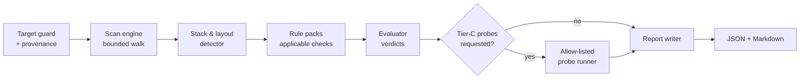

# 2. The Readiness Model

> **Target Audience:** CTOs, engineering leads, and architects reading a report.
> **Key Goal:** Define what the audit measures, how a verdict is reached, and what the resulting score does and does not mean.
> **Status:** Published — Page 2 of the User Overview; see [the index](../README.md).

---

## 1. One Score, One Axis of Truth

The report answers a single question: **how far is this repository from Phase 1 of the readiness framework?**

| Concept | Rule |
|---|---|
| Scored | Phase 1 (Bootstrap) requirements only, as defined by the framework's [Phase 1](../../../../../brownfield-legacy/Phased-Approach.md#phase-1-agentic-bootstrap-). |
| Reported, never scored | Phases 2–4 presence signals, and the hygiene set (README, CODEOWNERS, release process, contribution templates). These are **numberless**. |
| Presented separately | Attested items — properties no static scan can settle. |
| Never reported | Anything the scan did not look at. Silence is not a pass. |

There is no second score. A "code quality" number alongside the readiness number would invite the exact
misreading this tool exists to prevent: that readiness and quality are the same axis.

---

## 2. Two Axes: Phase and Severity

Phase answers *which framework requirement* a finding belongs to — it is provenance, useful for planning and
for reporting to a stakeholder who knows the methodology.

Severity answers *what it costs you today* — it is the work queue.

| Severity | Meaning | Example |
|---|---|---|
| **BLOCKER** | Agent work is impossible, unsafe, or unverifiable. Fix before onboarding agents. | No runnable test command; no non-interactive way to start the app; no agent governance file. |
| **DEGRADER** | Agent work is possible but unreliable or wasteful. | Two configs for one concern; skipped tests; run instructions that no longer resolve. |
| **COSMETIC** | Hygiene. Fix when convenient; it changes little. | Missing issue templates; no changelog. |

A Phase-6 artifact can be a blocker in practice, and a Phase-1 artifact can be cosmetic. Keeping the axes
separate is what lets the report be honest about both.

---

## 3. How Evidence Is Gathered: Tiers

| Tier | Method | Cost | Trust |
|---|---|---|---|
| **A** | Artifact existence and shape — files, manifests, parseable config | Milliseconds | High: the artifact is there or it is not |
| **B** | Content and cross-artifact invariants — required tokens, set differences, competing definitions, command references that resolve | Seconds | High, if the rule is stated precisely; this is where most value lives |
| **C** | Executed probes against the target — running its own verbs | Minutes; may execute untrusted code | Highest signal, highest risk. **Opt-in only** ([ADR-0002](../adrs/0002-read-only-and-tier-c-opt-in.md)) |

Tier C never runs by default. An audit that executes a repository's build scripts on open is a supply-chain
decision, not a lint, and it is not made on the user's behalf.

---

## 4. Verdicts

| Verdict | Meaning |
|---|---|
| `PASS` | The check's evidence rule was satisfied. |
| `PARTIAL` | Some of a multi-part requirement is satisfied — e.g. 3 of 7 declared components have a compliant `AGENTS.md`. Always carries the ratio. |
| `FAIL` | The evidence rule was not satisfied. |
| `UNKNOWN` | The check ran but could not gather evidence (unreadable path, unsupported ecosystem, size limit hit). **Not a pass, not a fail.** |
| `ATTEST` | The property is not statically verifiable and must be confirmed by a human. |

`UNKNOWN` exists so that an unsupported ecosystem degrades visibly instead of silently passing. A report that
cannot be wrong is worthless.

---

## 5. The Pipeline

---

## 6. What the Score Does and Does Not Mean

**Does mean:** the proportion of applicable Phase-1 requirements this repository *demonstrably* satisfies, with
every verdict carrying the evidence that produced it.

**Does not mean:** that agents will produce correct code. The framework states this plainly — quality gates
raise the probability of correctness and guarantee nothing. A repository can score full marks and still ship a
subtle logic error.

The report therefore always presents three things together: **the score**, **the blockers**, and **the
unattested list**. Reading the score without the third is the mistake this design exists to prevent.

---

## 7. Attested Items (Always Listed)

| Item | Why it cannot be scanned |
|---|---|
| The index is actually *used* by agents | Usage is a behaviour, not an artifact |
| Baselines are *adequate* for the debt they describe | Adequacy is a judgement about acceptable risk |
| The test suite is *trustworthy* | A green suite can be a suite that asserts nothing |
| Docs are *accurate* | Accuracy requires reading the code the docs describe |
| The team will *honour* the gate under deadline | An organisational property, not a file |

---

## 8. Exit Codes and the Ratchet

| Exit code | Meaning |
|---|---|
| `0` | Scan completed; no blockers above the configured threshold |
| `1` | Usage or input error — bad path, unreadable target, malformed rules |
| `2` | Blockers at or above the `--fail-on` threshold, or a regression against `--baseline` |

By default `--fail-on` is unset, so a first scan **always exits 0** and reports. CI integration is a
deliberate second step: compare against a baseline report and fail only on regression. The audit measures
readiness; it does not enforce it. See [ADR-0001](../adrs/0001-report-not-a-gate.md).

> [!IMPORTANT]
> The ratchet is what makes this tool re-runnable. A repository that was never agentic-ready is not failing
> anything; a repository that *stopped* being ready has a real problem, and that is worth a red build.

---

## Related Pages

- Previous: [1. Purpose & Non-Goals](01-purpose-and-non-goals.md)
- Next: [3. Why These Checks](03-why-these-checks.md)
- Deep-dives: [Scan Engine & Tiering](../contributor-deep-dive/01-scan-engine-and-tiering.md) · [Check Catalogue](../contributor-deep-dive/02-check-catalogue.md)
