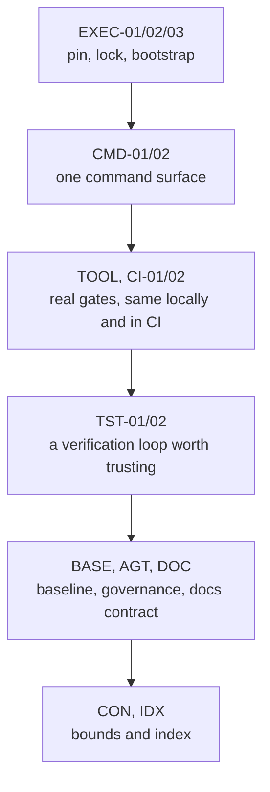

# How to Hand Findings to Remediation

> **Goal:** Convert a report into an ordered remediation plan and, where useful, a draft constraint list.
> **Audience:** Operators, engineering leads, consultants scoping an engagement
> **Status:** Live for the implemented packs (`AGT`, `EXEC`, `CMD`, `SEC`, `TOOL`, `CI`, `TST`, `BASE`, `CON`); the workflow below is what the tool does today. `--emit-baseline` now writes the draft constraint list (`constraints.draft.yaml`, `CON-04`); the other remediation inputs remain planned.

---

## Prerequisites

- [ ] A completed scan with `--format both`
- [ ] A copy of the readiness framework's Phase 1 open beside it
- [ ] Agreement on who owns the repository for the duration of the work

---

## Step-by-Step Instructions

### Step 1: Emit the remediation inputs

The scan already knows things a remediation pass needs — the components, their governance gaps, the measured
violation counts, and the paths that a constraint list should protect.

```bash
python3 -m audit <target> --format both --out ./audit-out/<target-name> --emit-baseline
```

> [!WARNING]
> `--emit-baseline` currently writes `constraints.draft.yaml` (`CON-04`) beside `audit-report.json`/`.md`.
> The remaining rows of the table below are the intended contract and are **not yet implemented**; the
> flag writes no other artifacts.

| Emitted artifact | Consumer | Status |
|---|---|---|
| `findings.json` | The work queue | Planned |
| `components.json` | Which components need `AGENTS.md` | Planned |
| `baseline-inputs.json` | The numbers a quality baseline is built from (`BASE-01`, `BASE-02`) | Planned |
| `constraints.draft.yaml` | The starting point for the allow/deny lists (`CON-04`) | Emitted |

### Step 2: Order the work by dependency, not by score

The Phase-1 requirements have a natural order, and doing them out of order wastes the earlier work:



Without a deterministic install and a single command surface, the gates cannot be trusted; without gates, the
baseline has nothing to measure; without a baseline, the constraints have no teeth.

### Step 3: Triage the draft constraint list

`constraints.draft.yaml` is a *draft*, derived from what the scan found: secrets and config, database migrations,
generated code, test directories, infrastructure-as-code, and production manifests.

> [!WARNING]
> `CON-01` is unscored in v1 because the framework defines no artifact name or schema for initial allow/deny
> lists. The draft is a starting point for a human decision, not a conformance claim. Treat the file as
> reviewed infrastructure — the framework records constraint erosion as a named risk.

### Step 4: Re-scan and compare

Re-scan after each tranche of work and compare against the previous report rather than against a target score.
The useful question is "did this tranche remove blockers?", not "is the number higher?".

```bash
python3 -m audit <target> --baseline ./audit-out/<target-name>/audit-report.json \
  --format md --out ./audit-out/<target-name>/run-02
```

---

## Verification

- Every BLOCKER finding has an owner and a target date.
- The draft constraint list has been reviewed line by line by a human, not accepted as generated.
- The re-scan shows the expected verdict transitions and no new findings introduced by the remediation itself.

---

## Next

- [Wire the ratchet into CI](wire-the-ratchet-into-ci.md)
