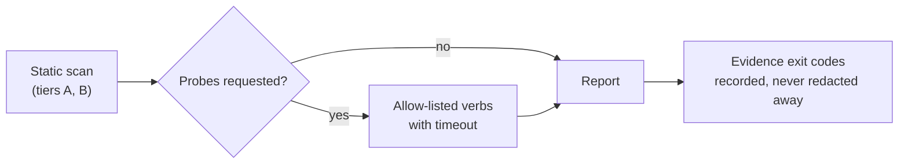

# How to Run an Audit

> **Goal:** Produce a readiness report for an existing repository without modifying it.
> **Audience:** Operators / Engineers
> **Status:** Live for the implemented packs (`AGT`); the workflow below is what the tool does today. Checks that are not implemented report `UNKNOWN`.

---

## Prerequisites

- [ ] Python 3.11+ on `PATH` (standard library only — nothing to install)
- [ ] Read access to the target repository
- [ ] The framework checkout (rule anchors resolve against the root of this repository)
- [ ] Know whether the target is a git repository and whether its working tree is dirty

---

## Step-by-Step Instructions

### Step 1: Confirm what is being scanned

The audit records the git SHA and dirty state in the report's provenance header. Scan a clean checkout of the
commit you intend to act on.

```bash
git -C <target> status --short --branch
git -C <target> rev-parse HEAD
```

### Step 2: Inspect the catalogue first (optional)

Useful before a first engagement scan, and the fastest way to confirm the ruleset matches the framework revision
you are citing.

```bash
python3 -m audit --list-checks
python3 -m audit --verify-rules --framework ../..
```

`--verify-rules` resolves every rule pack's framework anchor. If a heading has moved, it fails here rather than
producing a report that cites a section which no longer exists.

### Step 3: Run the static scan

```bash
python3 -m audit <target> \
  --format both \
  --out ./audit-out/<target-name>
```

This is read-only. It writes nothing inside the target and makes no network request. Exit code is `0` on a
completed scan regardless of findings — the audit reports, it does not gate.

### Step 4: Add the probes, only if you mean it

Tier-C probes execute the target's own commands. They are off by default because that is a supply-chain decision,
not a lint.

```bash
python3 -m audit <target> \
  --run-gates --allow-probe check --allow-probe test \
  --timeout 600 \
  --out ./audit-out/<target-name>
```



> [!WARNING]
> Probes run repository code with your user's privileges. Run them in a container or throwaway checkout for any
> repository you do not trust — the audit intentionally does not install dependencies or sandbox the target on
> your behalf.

---

## Verification

The scan completed if all of the following hold:

- Exit code is `0` (or `2` when `--fail-on` or `--baseline` was used and the condition was met).
- The report contains a provenance block with the target's git SHA.
- The summary counts add up: `pass + partial + fail + unknown + attest` equals the applicable check count.

```bash
python3 -m audit <target> --format json --out /tmp/probe.json && \
  python3 -c "import json;d=json.load(open('/tmp/probe.json'));print(d['summary']);print(len(d['findings']),'findings')"
```

---

## Next

- [Read the report](read-the-report.md)
- [Hand findings to remediation](hand-findings-to-remediation.md)
