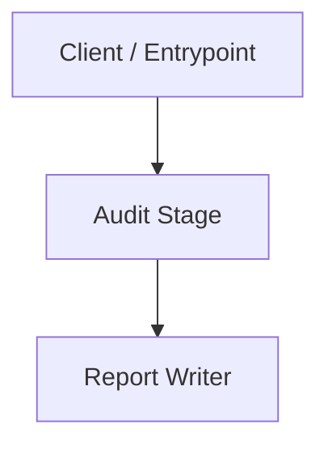

# [Component / Stage Name]

> **Audience:** Engineers & Architects
> **Related ADRs:** [ADR-0001](../architecture/adrs/0001-report-not-a-gate.md)
> **Status:** Planned — not yet implemented.

---

## 1. Responsibilities & Boundaries

- **Primary Goal:** [Summary of what this stage of the audit solves]
- **In-Scope:** [Explicit responsibilities]
- **Out-of-Scope:** [What this stage does not do — especially writes it must never perform]

---

## 2. Component Diagram

---

## 3. Interfaces & Contracts

| Interface | File | Description |
|---|---|---|
| `IAuditStage` | `audit/evaluate.py` | One stage of the audit pipeline |

---

## 4. Invariants & Failure Modes

- Invariant 1: ...
- Failure Mode: ...
