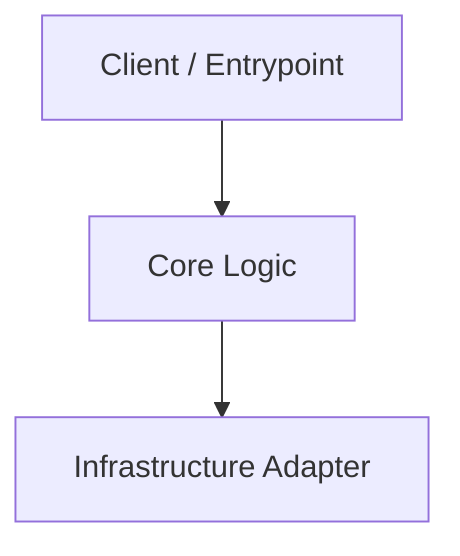

# [Component / Subsystem Name]

> **Audience:** Engineers & Architects
> **Related ADRs:** [ADR-0001](../architecture/adrs/0001-initial-architecture.md)

---

## 1. Responsibilities & Boundaries

- **Primary Goal:** [Summary of what this component solves]
- **In-Scope:** [Explicit responsibilities]
- **Out-of-Scope:** [What this component does not do]

---

## 2. Component Diagram

---

## 3. Interfaces & Contracts

| Interface | File | Description |
|---|---|---|
| `IMyPort` | `src/core/interfaces.ts` | Primary port for subsystem |

---

## 4. Invariants & Failure Modes

- Invariant 1: ...
- Failure Mode: ...
