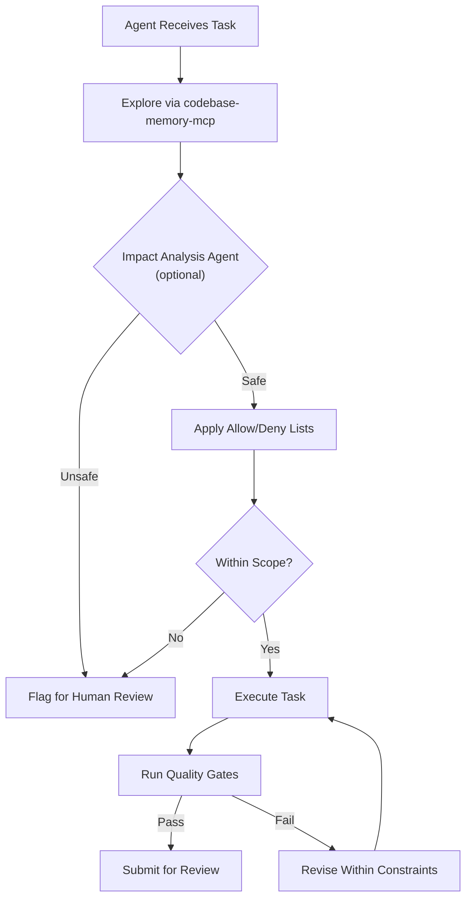

# Overview

[[_TOC_]]

## What Is an Agentic-Ready Codebase?

An **agentic-ready codebase** provides AI coding agents with the structure they need to work safely and accurately:

- **Focused and reliable context** — agents reason over relevant information, not the entire repo.
- **Clear interfaces and relationships** — boundaries are explicit, not implicit.
- **Deterministic development commands** — one command surface (`format`, `lint`, `typecheck`, `test`, `check`, `security`, realised as package scripts, a `Taskfile`, or a `Makefile`) produces identical results for agents, humans, and CI.
- **Executable quality gates** — automated checks that agents must pass before changes are accepted.
- **Tests that protect existing behavior** — characterization tests, contracts, and unit tests.
- **Documentation that evolves with the code** — generated, maintained, and indexed automatically.
- **Security and change-control boundaries** — agents operate within defined constraints.

> [!IMPORTANT]
> - **For existing codebases:** Readiness is built **incrementally** through a [4-phase foundation and 3-phase post-execution roadmap](../brownfield-legacy/Phased-Approach.md).
> - **For new codebases:** Readiness is established from Day 1 using the [Project Initialization Recipe](../greenfield-bootstrap/README.md).

### Applicability

| Codebase Type | Supported | Notes |
|---------------|-----------|-------|
| Monoliths | ✅ | Primary target |
| Monorepos | ✅ | Supported with component-level scoping |
| Microservices | ⚠️ | Not explicitly validated but no architectural reason to exclude |

---

## Constraint Engineering

> [!NOTE]
> Constraint Engineering is a **first-class concept** in this methodology. It is threaded through all phases and is the primary mechanism for preventing agents from making uncontrolled changes.

Constraint Engineering is about **what NOT to do** — enforcing boundaries and mandating analysis before code generation. It is a **proactive safety mechanism** that prevents agents from going amok.

### Principles

1. **Ensure analysis before generation**
   - Agents must explore code via `codebase-memory-mcp` before writing any code.
   - Optionally, a specialist impact-analysis agent validates proposed changes before execution.
2. **Constrain agent scope**
   - Explicit `allow:...` / `deny:...` lists for files, methods, interfaces, directories, and commands.
   - Agents cannot touch what they are not permitted to touch.

### Conceptual Overview of Constraint Engineering

### How Constraint Engineering Threads Through Phases

| Phase | Constraint Engineering Role |
|-------|----------------------------|
| [Phase 1](../brownfield-legacy/Phased-Approach.md#phase-1-agentic-bootstrap-) | Establish initial allow/deny lists. Configure deterministic commands that agents must use. |
| [Phase 3](../brownfield-legacy/Phased-Approach.md#phase-3-agent-oriented-documentation-) | `agentic-agentDocs` generates per-component constraint definitions: forbidden dependencies, data classification, ownership rules. |
| [Phase 4](../brownfield-legacy/Phased-Approach.md#phase-4-contracts-and-behavior-baselines-) | Contracts become enforceable constraints — agents must not break published interfaces. |
| [Phase 5](../brownfield-legacy/Phased-Approach.md#phase-5-optional-refactoring) | Refactoring is bounded to single components. Agents cannot weaken tests. |
| [Phase 7](../brownfield-legacy/Phased-Approach.md#phase-7-spec-driven-feature-development-) | Implementation plans are cross-checked against `codebase-memory-mcp` for impact before approval. |

---

## Assumptions

This approach is based on the following assumptions:

1. **Better context → better agent output.** Context engineering is possible only with high-quality, purpose-built documentation.
2. **Model reasoning capacity is finite.** Providing an LLM with unstructured information produces broken or incomplete results. The less that the LLM has to discover during runtime, the more capacity it has to understand the task and apply correct reasoning. Structured repository information can be built asynchronously and delivered synchronously. See [`codebase-memory-mcp`](https://github.com/nicobailon/codebase-memory-mcp).
3. **Smaller, task-specific context outperforms whole-repo context.**
4. **Deterministic commands and automated quality gates reduce rework and agent uncertainty.**
5. **Tests, contracts, and documentation preserve existing structure and behavior.**
6. **These practices reduce common agentic coding problems:** context bloat, spaghetti edits, specification drift, and inconsistent quality.
7. **Token efficiency is a byproduct, not the objective.** Better context reduces wasted tokens, discarded responses, repeated analysis, and rework — while preserving code longevity.
8. **Agents significantly improve probability of correctness but do not guarantee correctness.** Human review remains necessary for high-risk changes.
9. **Once documentation is built, sophisticated context engineering techniques become possible** — above and beyond what is currently implemented in [agentic-tdd context engineering](https://github.com/Nistapp/agentic-tdd/blob/main/docs/architecture/contributor-deep-dive/03-context-engineering.md) and [planned in impact analysis](https://github.com/Nistapp/agentic-tdd/discussions/11).

---

## Core Intelligence Layer

`codebase-memory-mcp` is used by **every phase** to identify symbols, dependencies, callers, callees, tests, contracts, and related documentation. It serves as the shared knowledge backbone that all tools and agents query before performing work.

---

← [Home](../README.md) · [Legacy Phased Approach →](../brownfield-legacy/Phased-Approach.md) · [New Project Recipe →](../greenfield-bootstrap/README.md)
