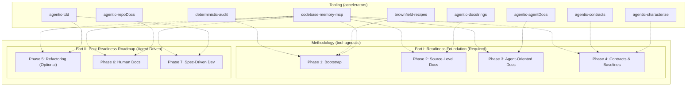
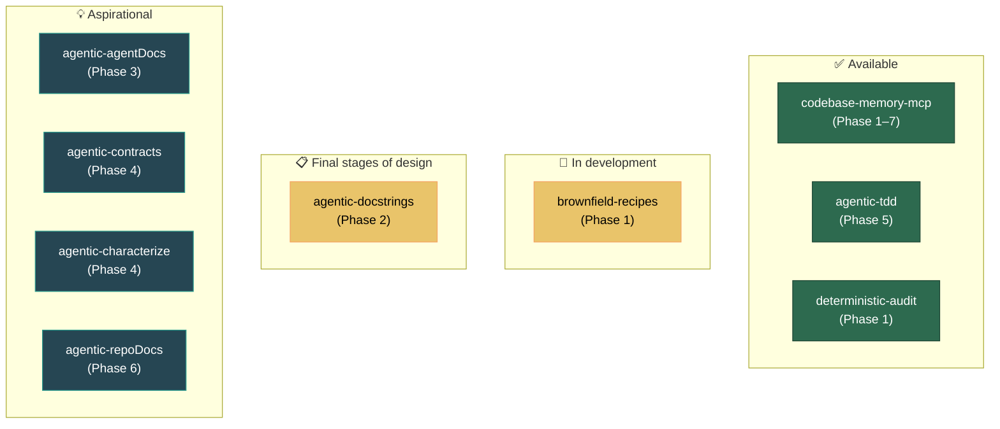

# Tool Ecosystem

## Methodology vs. Tooling

> [!IMPORTANT]
> The methodology described in this framework stands on its own. A team can follow the [legacy phased approach](../brownfield-legacy/Phased-Approach.md) or the [greenfield initialization recipe](../greenfield-bootstrap/README.md) manually without any of the tools listed below. The tools **accelerate adoption** but are not prerequisites.

The agentic-ready approach has two distinct layers:

A well-prepared codebase should give exceptional results with **any** coding agent — Claude Code, Cursor, OpenCode, Goose — and of course with `agentic-tdd` too.

---

## Tool Maturity

| Tool | Status | Phase | Description |
|------|--------|-------|-------------|
| `codebase-memory-mcp` | ✅ Available | 1–7 | Core intelligence layer. Indexes symbols, relationships, dependencies, tests, contracts. Queried by all phases. |
| `agentic-tdd` | ✅ Available | 5 | Supports controlled, test-driven feature development and refactoring with AI agents. |
| [`deterministic-audit`](../brownfield-recipes/deterministic-audit/README.md) | ✅ Available | 1 | A read-only, standard-library Python scanner. It checks an existing repository against the Phase 1 readiness checks, with no LLM and no network, and writes a JSON and Markdown report. Run it from a clone of this repository; it is not yet released as a package. |
| [`brownfield-recipes`](../brownfield-recipes/README.md) | 🚧 In development | 1 | LLM-driven recipes for existing repositories: one audits readiness and one implements the fixes. They build on `deterministic-audit` and add model judgment backed by cited evidence. |
| `agentic-docstrings` | 📋 Planned | 2 | Will generate and maintain source-level documentation (docstrings, parameter descriptions, side effects). |
| `agentic-agentDocs` | 📋 Planned | 3 | Will create structured, agent-oriented documentation and task-specific context packs. Currently in conceptualisation. |
| `agentic-contracts` | 💡 Aspirational | 4 | Will generate and validate API contracts, event schemas, and consumer-provider relationships. |
| `agentic-characterize` | 💡 Aspirational | 4 | Will produce characterization tests and golden-master baselines for existing behavior. |
| `agentic-repoDocs` | 💡 Aspirational | 6 | Will create human-facing repository documentation following the Diátaxis model. The manually created docs `agentic-tdd` can be found [`here`](https://github.com/Nistapp/agentic-tdd/tree/main/docs). `agentic-repoDocs` will automate this process in the future.|

### Maturity Legend

| Badge | Meaning |
|-------|---------|
| ✅ Available | Existing, usable today |
| 🚧 In development | Being built now; parts exist, but it is not usable end to end yet |
| 📋 Planned | Actively planned for near-term development |
| 💡 Aspirational | Conceptual; development has not started |

### Tool Maturity Map

---

## Reference Implementation — `agentic-tdd`

`agentic-tdd` is the live worked example of Phases 1–4, including the Phase 1 command
surface and the documentation contract. Copy its conventions instead of inventing local
variants:

| Practice | Where to look |
|---|---|
| Agent governance — DI boundaries, commit and release lifecycle, documentation rules | `AGENTS.md` |
| Canonical documentation rules — invariants, Diátaxis tracks, ADR lifecycle, doc-maintenance trigger | `docs/STYLE_GUIDE.md` |
| Standardized command surface as package scripts — `format`, `format:check`, `lint`, `typecheck`, `test`, `check`, `security` | `package.json` → `scripts` |
| CI invoking the same script names a developer runs locally | `.github/workflows/ci.yml`, `.github/workflows/security.yml` |
| A real change set that updated docs alongside the code (`npm run check` gate, `typecheck` verb, STYLE_GUIDE compliance) | `docs/architecture/contributor-deep-dive/08-developer-guide.md` § Verification Workflow |

Repository: <https://github.com/Nistapp/agentic-tdd>. Some of the conventions above are on
the branch under active development rather than the default branch — read the branch before
copying, and treat this repository as the source of truth over any restatement here.

---

## Shared Conventions

All tools will be published as independent open-source packages, each focused on a single responsibility. Node and TypeScript tools will be npm packages. Python tools, such as `deterministic-audit`, use only the standard library and run from a checkout or from a single-file `.pyz`, so they need no install step. The recipes will ship as agent skills (`SKILL.md` bundles) together with the Python tools they call. All of them will share common conventions for:

- **Configuration** — consistent config file formats and defaults.
- **Reporting** — structured output with provenance metadata.
- **Verification** — each tool validates its own output before committing.
- **Integration** — the tools that read code query and update `codebase-memory-mcp`. `deterministic-audit` reads the repository itself and only checks that an index exists.

---

← [Home](../README.md) · [Legacy Phased Approach](../brownfield-legacy/Phased-Approach.md) · [Risks and Mitigations](Risks-and-Mitigations.md)
